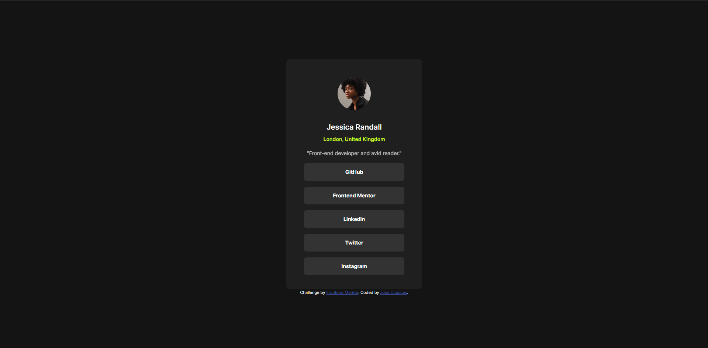

# Frontend Mentor - Social links profile solution

This is a solution to the [Social links profile challenge on Frontend Mentor](https://www.frontendmentor.io/challenges/social-links-profile-UG32l9m6dQ). Frontend Mentor challenges help you improve your coding skills by building realistic projects. 

## Table of contents

- [Overview](#overview)
  - [The challenge](#the-challenge)
  - [Screenshot](#screenshot)
  - [Links](#links)
- [My process](#my-process)
  - [Built with](#built-with)
  - [What I learned](#what-i-learned)
  - [Continued development](#continued-development)
- [Author](#author)

**Note: Delete this note and update the table of contents based on what sections you keep.**

## Overview

### The challenge

Users should be able to:

- See hover and focus states for all interactive elements on the page

### Screenshot



### Links

- Solution URL: [Add solution URL here](https://github.com/jcuacuas/social-links-profile?tab=readme-ov-file)
- Live Site URL: [Add live site URL here](https://jcuacuas.github.io/social-links-profile/)

## My process

### Built with

- Semantic HTML5 markup
- CSS custom properties
- Desktop-first workflow

### What I learned
I used semantic html and css. I didn't use flexbox or grid to create the button menu. I realized I could just create everything using simple solutions.

```css
.profile-card {
  margin: 10rem auto 0;
  text-align: center;
}

.profile-card___button {
  width: 100%;
}
```
I was able to center everything using the text-align property and setting the horizontal margin to auto.
The profile button was created by setting the width to 100%. I also liked separating the css files into its own folder to keep things neat.

### Continued development

It took me a while to figure out I need to set the width of the parent element to make the button as wide as I needed them to be. In the future I plan on sketching
out a plan better or creating pseudo code so that I don't get stuck or lost on what to do.

## Author

- Github - [Jose Cuacuas](https://github.com/jcuacuas)
- Frontend Mentor - [@jcuacuas](https://www.frontendmentor.io/profile/jcuacuas)